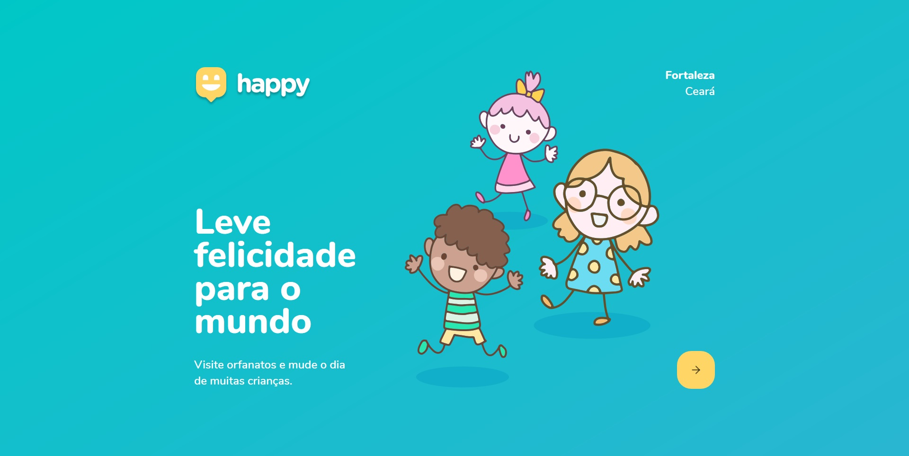
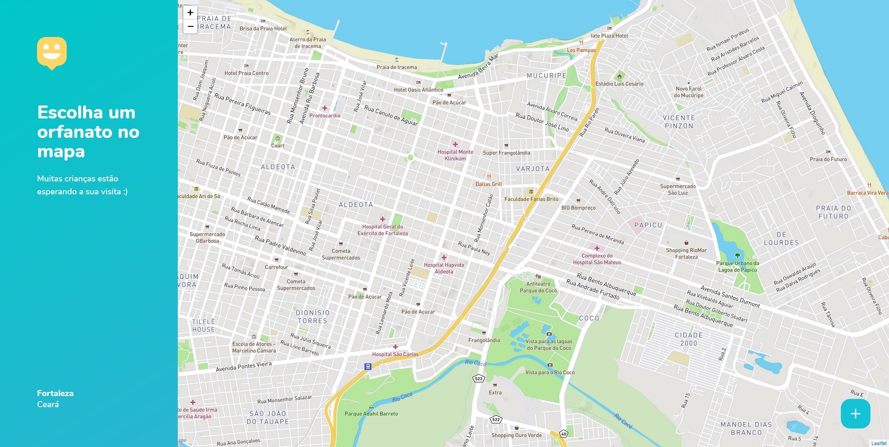

# Happy
## Sobre
Projeto desenvolvido na NLW#3 do RocketSeat, trilha OmniStack. Trata-se de um sistema que funciona em aplicações Web e Mobile, para localização e visitação de orfanatos. No caso desta versão, aplicada à cidade de Fortaleza, Ceará.

## Tecnologias
A aplicação Web terá o front-end desenvolvido em React.js. O back-end da aplicação Web é compartilhado com front-end do mobile. Back-end será desenvolvido em Node.js e o front-end mobile em ReactNative.

## Prints e telas:
### Landing Page:

Landing Page da aplicação.

### Tela de mapa de orfanatos

Tela de mapa de orfanatos. Utilização do mapbox, com token arquivado em variável ambiente protegida.

## Status do projeto
O projeto encontra-se em desenvolvimento e será atualizado a cada nova aula/implementação.
